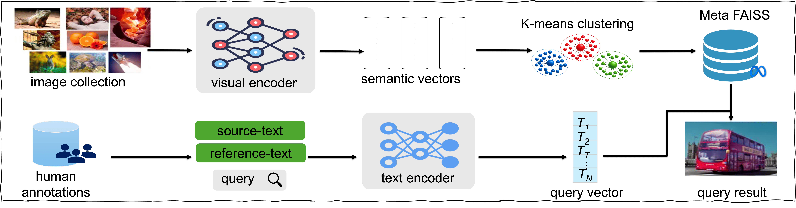
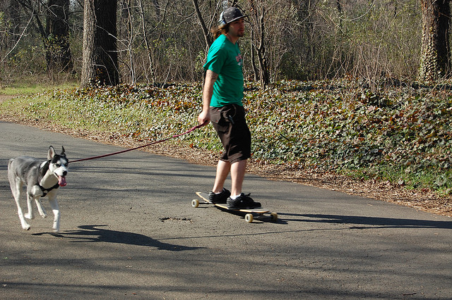
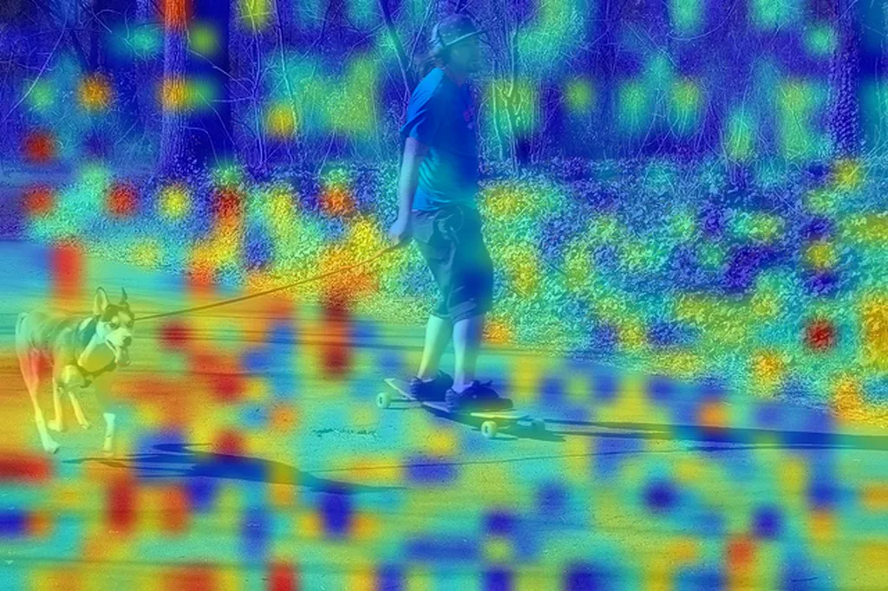
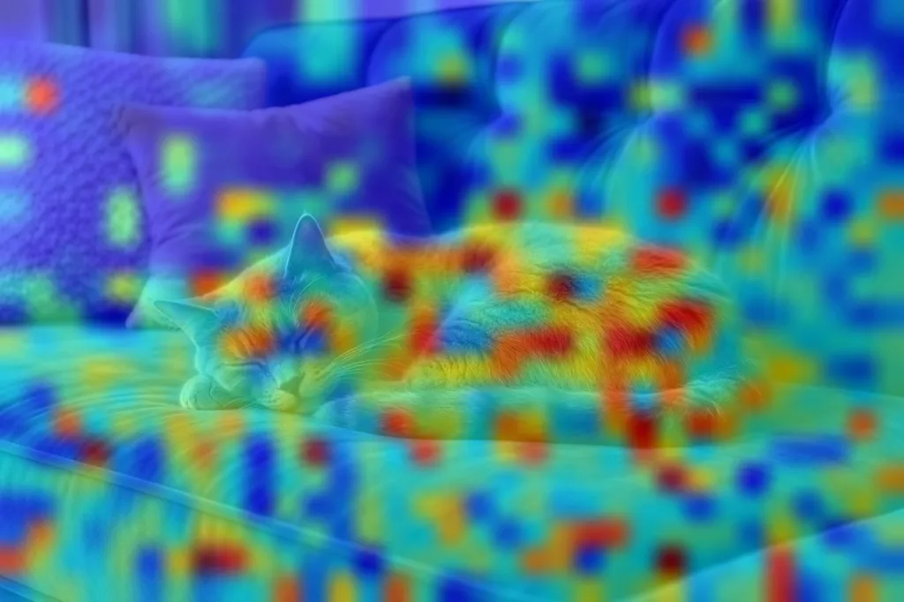

# Grounded Evaluation of Multimodal Machine Translation Systems

> **Sami Ul Haq** · **Sheila Castilho** · **Yvette Graham**  
> ADAPT Centre, Dublin City University & Trinity College Dublin  

📄 **[View Poster (Google Drive)](https://drive.google.com/file/d/1GWc6T_CVETYm5PNGqHK0K-dmyQi_vv1j/view?usp=share_link)**

---

## Overview

We propose evaluating Multimodal Machine Translation (MMT) systems by incorporating **multimodal context during evaluation**. To support this, we introduce **MuTE** — a Multimodal MT Evaluation dataset that aligns human-annotated text data with real-world images using a multilingual Visual Language Model.

---

## The MuTE Dataset

MuTE is constructed by aligning WMT human annotations (ecommerce domain) with a large-scale image collection via multilingual and multimodal retrieval.

**Dataset Statistics:**
- 12K instances extracted for **English**, **French**, and **German**
- Images sourced from LAION, Flickr30K, MSCOCO, and Visual Genome (1.3M images total)
- Evaluated on text–image retrieval and multilingual alignment on MSCOCO

---

## Dataset Generation Pipeline

## Examples

### ✅ Good Examples

Good examples show strong image–text alignment across languages, where the retrieved image clearly corresponds to the meaning of the source and translation.

| Text | Retrieved Image | Overlay |
|---|---|---|
| A man skateboarding while walking his dog. Un homme faisant du skateboard en promenant son chien. |  |  | 
| A grey cat is sleeping on a blue velvet sofa. Eine graue Katze schläft auf einem blauen Samtsofa. |  |  |
*Key aligned tokens: `<man>` ↔ `<chien>`, `<walking>` ↔ `<promenant>`*

---

### ❌ Bad Examples

Bad examples show cases where the retrieved image does not align well with the source text, the models seems to struggle with count, colors, negation or positional aspects.

| Text | Retrieved Image | Issues | 
|---|---|---|
| English | A man skateboarding while walking his dog. |  | 
| French | Un homme faisant du skateboard en promenant son chien. |  |

> 💡 Place your example images in the [`images/`](images/) folder following the naming convention `good_example_*.jpg` / `bad_example_*.jpg`.

---

## Relevant Papers

**Multimodal Machine Translation**
- Specia, L. et al. (2016). [A Shared Task on Multimodal Machine Translation and Crosslingual Image Description](https://aclanthology.org/W16-2346/). *WMT 2016.*
- Yao, T. & Wan, X. (2020). [Multimodal Transformer for Multimodal Machine Translation](https://aclanthology.org/2020.acl-main.400/). *ACL 2020.*
- Li, Y. et al. (2022). [Vision-Language Pre-Training for Multimodal MT](https://aclanthology.org/2022.acl-long.133/). *ACL 2022.*

**Multimodal Retrieval & Embeddings**
- Schuhmann, C. et al. (2022). [LAION-5B: An open large-scale dataset for training next generation image-text models](https://arxiv.org/abs/2210.08402). *NeurIPS 2022.*
- Johnson, J. et al. (2021). [Billion-scale similarity search with GPUs (FAISS)](https://arxiv.org/abs/1702.08734). *IEEE TBIG 2019.*
- Koukounas, A. et al. (2024). [jina-embeddings-v4: Universal Embeddings for Multimodal and Multilingual Retrieval](https://arxiv.org/abs/2506.18902). *arXiv 2024.*

**Multilingual & Vision-Language Models**
- Radford, A. et al. (2021). [Learning Transferable Visual Models From Natural Language Supervision (CLIP)](https://arxiv.org/abs/2103.00020). *ICML 2021.*
- Lin, T.-Y. et al. (2014). [Microsoft COCO: Common Objects in Context](https://arxiv.org/abs/1405.0312). *ECCV 2014.*

---

*This research was conducted with the financial support of Research Ireland under Grant Agreement No. 13/RC/2106_P2 at the ADAPT Centre at Dublin City University.*
